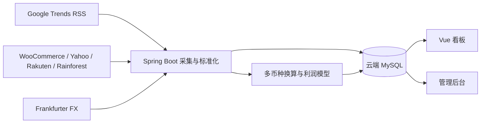

# 跨境数据源接入与采集入库操作手册

> 适用项目：本仓库 Spring Boot 3 + Vue 3 版本。目标是让公开趋势、商品目录和汇率进入云端 MySQL，再由网页直接查看与生成利润日报。

## 1. 现在已经能直接使用什么

| 数据能力 | 当前状态 | Key | 写入位置 | 网页入口 |
|---|---|---:|---|---|
| Google Trends 热门搜索 RSS（JP/US/SG） | 已接入 | 不需要 | `trend_signals`、`data_collection_runs` | 前台“搜索趋势”、后台“数据源配置” |
| Frankfurter 公共汇率（默认 JPY/CNY） | 已接入 | 不需要 | `exchange_rates`、`data_collection_runs` | 前台汇率指标、后台“数据源配置” |
| WooCommerce 公开 Store API 商品 | 已接入 | 不需要 | `trend_reports`、`trend_products`、`domestic_links` | 前台商品机会池、后台商品池/日报 |
| Yahoo! Japan Shopping v3 | 适配器已完成 | Client ID | 同上 | 配好凭证后自动加入真实日报 |
| Rakuten Ichiba Item Search 2026 | 适配器已完成 | Application ID + Access Key | 同上 | 配好凭证后自动加入真实日报 |
| Amazon / Rainforest API | 适配器已完成 | API Key | 同上 | 配好凭证后自动加入真实日报 |
| DeepSeek 标题标准化 | 已接入、可选 | API Key | 标准化结果随日报商品保存 | 后台开启“AI 智能标准化” |

默认配置使用 **真实数据模式 `external`**。真实数据源失败时会显示错误，不会悄悄拿 Demo 冒充真实数据。

## 2. 数据是怎样流动的



商品采用统一字段：源站、源站链接、原币售价、币种、人民币换算价、图片、热度、品类、国内采购估算、物流、利润和毛利率。日报保存当时的换算结果，历史报表不会因今天汇率变化而被改写。

## 3. 第一次启动：照着做即可

### 第 1 步：准备云端 MySQL

数据库需要满足：

- MySQL 8.x 或 MariaDB 10.6+；
- 字符集 `utf8mb4`；
- 应用账号拥有目标库的 `SELECT, INSERT, UPDATE, DELETE, CREATE, ALTER, INDEX` 权限；
- 从运行 Spring Boot 的机器可以访问数据库端口；
- 建议连接池先保持 `DB_POOL_MAX_SIZE=3`，避免小规格云数据库连接数耗尽。

Flyway 会自动创建/升级表，不需要手工执行迁移 SQL。

### 第 2 步：填写 `credentials.txt`

项目根目录建立 `credentials.txt`。这个文件已被 Git 忽略，不要把 Token 写进源码或提交记录。

```ini
[mysql.remote]
host=你的数据库地址
port=3306
database=crossborder_trend_demo
user=应用账号
password=数据库密码

# 可选：AI 标准化。也兼容在本节只放一行原始 Token。
[deepseek.api]
api_key=你的_DeepSeek_API_Key

# 可选：日本乐天
[rakuten.api]
application_id=你的_Application_ID
access_key=你的_Access_Key

# 可选：Yahoo 日本购物
[yahoo.shopping]
client_id=你的_Client_ID

# 可选：Amazon 结构化数据
[rainforest.api]
api_key=你的_Rainforest_API_Key
```

只想先体验免 Key 数据源时，仅填写 `[mysql.remote]` 即可。

### 第 3 步：复制非敏感配置

```powershell
cd E:\codes\crossborder-trend-report
Copy-Item .env.example .env
```

确认 `.env` 至少包含：

```env
DB_TARGET=remote
SOURCE_MODE=external
GOOGLE_TRENDS_ENABLED=true
GOOGLE_TRENDS_REGIONS=JP,US,SG
FRANKFURTER_ENABLED=true
WOOCOMMERCE_ENABLED=true
WOOCOMMERCE_STORE_URLS=https://www.somethingfromjapan.com
AI_ENRICHMENT_ENABLED=true
```

`WOOCOMMERCE_STORE_URLS` 支持逗号分隔多个公开店铺。店铺必须能访问 `/wp-json/wc/store/v1/products`。

### 第 4 步：后台启动（不会占住当前终端）

```powershell
.\scripts\start-dev-windows.ps1 -SkipInstall -WaitForReady
```

启动脚本会：读取 `credentials.txt`、连接云端 MySQL、执行 Flyway、在隐藏的后台进程启动 8090/5174，并把日志写入 `logs/`。当前 PowerShell 会在就绪后返回，可以继续输入命令。

常用操作：

```powershell
.\scripts\status-dev-windows.ps1
.\scripts\stop-dev-windows.ps1
Get-Content .\logs\backend.log -Tail 100
Get-Content .\logs\backend.err.log -Tail 100
```

### 第 5 步：在网页完成首次采集

1. 打开 `http://127.0.0.1:5174/admin`；
2. 登录（开发库默认 `admin / admin`）；
3. 左侧进入 **选品配置 → 数据源配置**；
4. 对 Google Trends、Frankfurter、WooCommerce 依次点 **测试连接**；
5. 对 Google Trends、Frankfurter 点 **立即同步**；
6. 点页面右上角 **采集商品并生成日报**；
7. 打开前台 `http://127.0.0.1:5174/` 查看趋势、汇率、商品图片和利润；
8. 后台的 **报表管理 → 日报记录/商品池** 可以查看入库结果。

Google Trends 的后台按钮默认同步 JP。需要同步 US/SG 时可以使用下面的 API，定时任务则会自动轮询 `.env` 中全部区域。

## 4. 用 API 手工验证（PowerShell）

```powershell
$base = 'http://localhost:8090'
$session = Invoke-RestMethod -Method Post -Uri "$base/api/admin/login" `
  -ContentType 'application/json; charset=utf-8' `
  -Body (@{ username='admin'; password='admin' } | ConvertTo-Json)
$headers = @{ Authorization = "Bearer $($session.token)" }

# 测试三个开箱即用的数据源
Invoke-RestMethod -Method Post -Uri "$base/api/admin/data-sources/google-trends/test" -Headers $headers -ContentType 'application/json' -Body '{"region":"JP"}'
Invoke-RestMethod -Method Post -Uri "$base/api/admin/data-sources/frankfurter/test" -Headers $headers -ContentType 'application/json' -Body '{}'
Invoke-RestMethod -Method Post -Uri "$base/api/admin/data-sources/woocommerce/test" -Headers $headers -ContentType 'application/json' -Body '{}'

# 写入趋势和汇率
foreach ($region in 'JP','US','SG') {
  Invoke-RestMethod -Method Post -Uri "$base/api/admin/data-sources/google-trends/collect" -Headers $headers -ContentType 'application/json' -Body (@{region=$region} | ConvertTo-Json)
}
Invoke-RestMethod -Method Post -Uri "$base/api/admin/data-sources/frankfurter/collect" -Headers $headers -ContentType 'application/json' -Body '{}'

# 采集商品、换算汇率、计算利润并生成日报
Invoke-RestMethod -Method Post -Uri "$base/api/collect/run" -Headers $headers -ContentType 'application/json' -Body '{"force":true}'

# 查看结果
Invoke-RestMethod "$base/api/trend-signals?region=JP&limit=10"
Invoke-RestMethod "$base/api/exchange-rates/latest?base=JPY&quote=CNY"
Invoke-RestMethod "$base/api/reports/latest"
```

## 5. 如何换成更多真实 WooCommerce 店铺

WooCommerce Store API 是公开商品目录接口，通常不需要消费者密钥。

1. 找到目标店铺首页，例如 `https://shop.example.com`；
2. 浏览器打开 `https://shop.example.com/wp-json/wc/store/v1/products?per_page=5`；
3. 返回 JSON 商品数组，且含 `name`、`prices`、`permalink`、`images`，说明可接；
4. 把店铺根地址加入 `.env`：

```env
WOOCOMMERCE_STORE_URLS=https://shop-a.example.com,https://shop-b.example.com
```

5. 重启项目，在后台测试 WooCommerce；
6. 生成日报。系统会自动解析最小货币单位，例如 `1299 + USD + minor_unit=2` 会保存为 `12.99 USD`。

若接口 404，可能是该站不是 WooCommerce、关闭了 Store API，或 WordPress 安装在子目录。此时不要填首页猜测路径，先确认真实 API 根地址。

## 6. Yahoo! Japan Shopping：准备材料和步骤

官方文档：<https://developer.yahoo.co.jp/webapi/shopping/v3/itemsearch.html>

准备：

- 可登录 Yahoo! JAPAN Developer Network 的账号；
- 应用名称、用途说明、联系人信息；
- 创建应用后得到的 **Client ID（appid）**。

操作：

1. 在 Yahoo! JAPAN Developer Network 创建应用；
2. 为应用启用 Shopping Web API；
3. 复制 Client ID 到 `credentials.txt` 的 `[yahoo.shopping] client_id`；
4. 重启后在数据源中心看到“已配置”；
5. 点“测试连接”，成功后生成日报；
6. 适配器会读取名称、价格、图片、评分、评论数和商品链接，并优先请求可跨境代购、在库、全新商品。

不需要店铺授权；这是公开商品检索，不包含你店铺的订单、库存或买家信息。

## 7. Rakuten Ichiba 2026：准备材料和步骤

官方文档：<https://webservice.rakuten.co.jp/index.php/documentation/ichiba-item-search>

准备：

- Rakuten Web Service 账号；
- 应用名称、网站/服务 URL、用途说明；
- **Application ID**；
- 2026 版接口要求的 **Access Key**。

操作：

1. 注册 Rakuten Web Service 并创建应用；
2. 在应用详情复制 Application ID 和 Access Key；
3. 写入 `credentials.txt` 的 `[rakuten.api]`；
4. 重启并在后台测试连接；
5. 测试成功后生成日报。适配器会按评论数排序，读取价格、图片、评论和海外配送信息。

默认接口版本为 `20260701`，需要调整时设置环境变量 `RAKUTEN_API_VERSION`。

## 8. Amazon 数据：当前推荐与后续正式方案

### 快速商品研究：Rainforest API

1. 注册 Rainforest API；
2. 获取 API Key；
3. 写入 `[rainforest.api] api_key`；
4. 重启、测试、生成日报。

当前适配器查询 `amazon.co.jp`，解析标题、价格、评分、评论、排名、ASIN、图片和链接。它适合商品研究，通常按调用量付费。

### 自有店铺经营数据：Amazon SP-API

如果需要真实订单、库存、销售额和退货，不应使用公开搜索接口，需要：

- 专业卖家账号；
- Developer Profile / 应用；
- LWA Client ID、Client Secret；
- 卖家授权后的 Refresh Token；
- Marketplace ID；
- HTTPS OAuth 回调地址；
- 对应订单、库存或报表权限。

这类私有数据建议第二阶段新增 `seller_connections`、加密凭证存储、OAuth 回调、增量游标和店铺隔离，不与公开选品目录混在一个 Token 中。

## 9. AI 标准化（可选）

配置 DeepSeek 后，系统会批量完成：

- 外文标题转为中文选品名；
- 在后台允许的品类中归类；
- 提取中日/英文关键词；
- 基于来源排名、评论等现有证据生成理由。

它不会生成不存在的销量。调用失败时保留源站标题和规则分类，商品采集仍可完成。关闭方式：

```env
AI_ENRICHMENT_ENABLED=false
```

或在后台“采集策略”关闭 **AI 智能标准化**。

## 10. 云端 MySQL 验证 SQL

```sql
SELECT version, description, installed_on, success
FROM flyway_schema_history
ORDER BY installed_rank;

SELECT source_key, status, item_count, message, started_at, finished_at
FROM data_collection_runs
ORDER BY id DESC
LIMIT 20;

SELECT region, keyword, traffic_label, traffic_value, published_at
FROM trend_signals
ORDER BY published_at DESC, traffic_value DESC
LIMIT 30;

SELECT base_currency, quote_currency, rate_date, rate_value, provider
FROM exchange_rates
ORDER BY rate_date DESC;

SELECT r.id, r.report_date, r.source_mode, COUNT(p.id) product_count
FROM trend_reports r
LEFT JOIN trend_products p ON p.report_id = r.id
GROUP BY r.id, r.report_date, r.source_mode
ORDER BY r.id DESC
LIMIT 10;

SELECT product_name_cn, source_platform, source_price, source_currency,
       source_price_cny, image_url, estimated_profit_cny, estimated_margin
FROM trend_products
ORDER BY id DESC
LIMIT 20;
```

## 11. 常见问题

### “真实数据源没有返回候选商品”

依次检查：后台采集模式是否为 `external`、WooCommerce 测试是否成功、目标品类是否包含商品规则分类、`maxProducts` 是否大于 0。真实模式不会回退 Demo，所以错误本身就是需要修复的连接或筛选问题。

### Google Trends 某区域无法同步

区域必须在 `GOOGLE_TRENDS_REGIONS` 中，使用两位大写代码。修改 `.env` 后重启。

如果当前网络直连 Google 超时，而本机已有 HTTP 代理，可增加：

```env
OUTBOUND_HTTP_PROXY=http://127.0.0.1:20808
```

该配置只影响后端访问外部数据源，不影响 MySQL 和浏览器。云服务器能够直连时留空。

### 商品原币不是 JPY

系统会从源站读取 ISO 币种，再按 `exchange_rates` 换算 CNY。未缓存的币种会即时请求 Frankfurter；JPY 失败时才使用后台兜底值，其他币种无法获得汇率时会明确终止利润计算。

### 数据库有中文/日文乱码

确认库、表、连接均为 `utf8mb4`。当前代码、JDBC URL 和网页均按 UTF-8；不要用未指定 UTF-8 的旧命令行工具导入 SQL。

### 弹窗在小屏幕超出页面

新版弹窗使用 `max-height: calc(100dvh - 48px)`，表单正文独立滚动；若仍异常，清理 Vite 缓存并强制刷新浏览器。

## 12. 下一批可扩展数据源

| 数据源 | 可获得内容 | 凭证/限制 | 建议优先级 |
|---|---|---|---:|
| eBay Browse API | 全球公开商品搜索、价格、图片 | eBay Developer App + OAuth Application Token | 高 |
| Best Buy Products API | 美国电子消费品、价格、分类 | 免费开发者 API Key，区域偏美国 | 中 |
| Keepa | Amazon 历史价、BSR、Buy Box | 付费 Token | 高（做历史曲线时） |
| Shopify Storefront / Admin API | 公开目录或自有店铺订单库存 | Storefront Token / 店铺 OAuth | 中 |
| TikTok Shop Partner API | 授权店铺商品、订单、库存 | Partner 应用、权限审核、卖家 OAuth | 高（进入店铺运营阶段） |
| 1688 开放平台/供应商报价单 | 国内真实采购价、SKU、库存 | 开放平台应用或供应商文件 | 高（替换当前成本估算） |

新增适配器时复用 `TrendCandidate` 统一模型，并遵守：原始币种不丢失、来源链接可追溯、失败有采集记录、同一商品幂等去重、公开数据和卖家私有数据分表管理。

## 13. 官方资料

- Google Trends：<https://trends.google.com/trending>
- Frankfurter：<https://frankfurter.dev/>
- WooCommerce Store Products API：<https://developer.woocommerce.com/docs/apis/store-api/resources-endpoints/products>
- Yahoo! Shopping Item Search v3：<https://developer.yahoo.co.jp/webapi/shopping/v3/itemsearch.html>
- Rakuten Ichiba Item Search：<https://webservice.rakuten.co.jp/index.php/documentation/ichiba-item-search>
- eBay Browse API：<https://developer.ebay.com/api-docs/buy/static/api-browse.html>
- Best Buy APIs：<https://developer.bestbuy.com/apis>
